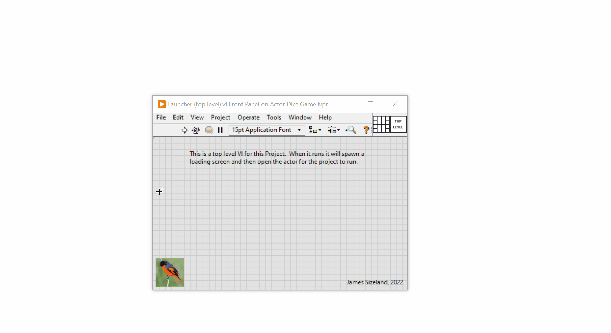

# Actor Framework Dice Game

## Overview

Experiment with the LabVIEW Actor Framework in 2021sp1 community edition.  Building a dice game with actor framework

## Framework

### VIPM Dependencies

- Monitored Actors:  ^2.0.0.23 - [website link](https://www.mooregoodideas.com/actor-framework/monitored-actor/monitoring-actors/)

- MGI Message Maker: - ^2.0.0.23

### Top-level

The project is structured with a clear entry point called Launcher (top level).  This allows us to select a number of actors to clone and spawn.

### Loader

The loader uses a .NET control to render a javaScript loading splash that can be customized.

## Contributors

- James Sizeland, 2022
